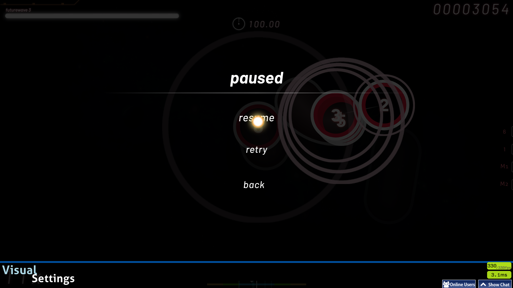

# Futurewave 2 osu! skin

All assets were created using Adobe Illustrator.
 
This skin was made for the normal osu! gamemode so compatibility with other gamemodes isn't guaranteed. Also, since my move to Windows, I have stopped creating a version for 16:10 screen ratios.
 

## Credits

- Avenir Next font by Adrian Frutiger
- Space Age font by Justin Callaghan
- Geo font by Ben Weiner

Please create an issue if I haven't credited something properly.

## How to install

Releases > Futurewave \<version> > Download .osk file with needed screen size ratio > Open file
 
More info here: https://osu.ppy.sh/wiki/en/Installation#adding-skins

 

## Screenshots

