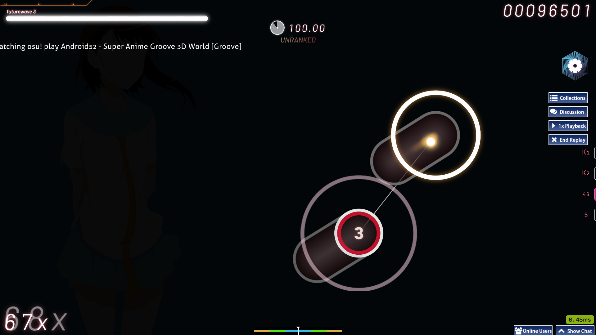

**Latest version: `v4.0.0` [Download skin](https://github.com/Avoxel284/futurewave/releases/download/v4.0.0/Futurewave.4.0.0.osk)**

All assets were created using Adobe Illustrator.
 
This skin was made for the normal osu! gamemode so compatibility with other gamemodes isn't guaranteed. Suitable for 16:9 displays, also doesn't contain any sounds.

Probably the last version of this skin.

 

## Credits

- "Avenir Next" font by Adrian Frutiger
- "Barlow" font by Jeremy Tribby

Please create an issue if I haven't credited something properly.

## How to install

Releases > Futurewave \<version> > Download .osk file with needed screen size ratio > Open file
 
More info here: https://osu.ppy.sh/wiki/en/Installation#adding-skins

 

## Screenshots

